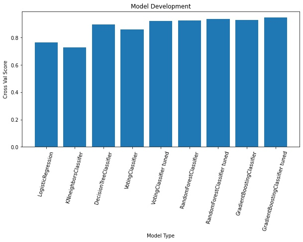
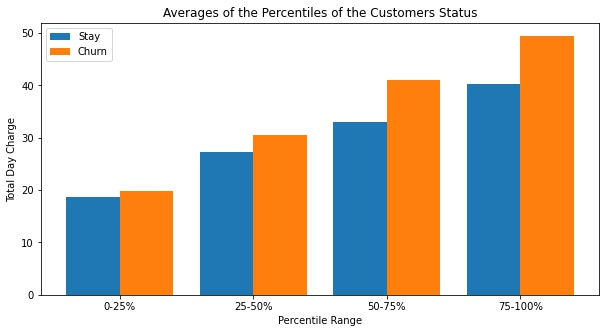

# Customer retention plan for Syriatel Mobile Telecom
 
 
**Author: Kyle Weesner**
 


## Overview
Syriatel Mobile Telecom is a service pervider that currently serves more than 8 million people today having 199 international roaming partners in 116 countries.  As a data scientist, I am currently creating a model to predict when might customers churn.  By building a model to help predict when customers will deter away from the service I can either offer additional advice to for the company to allocate resources to make the customer happier and improve our services that may be not opitimal at the time.  This is a great way to see where improvements to the company may need to be done. 


## Business Problem
Service providers strive to maintain a healthy balance between gaining new customers while minimizing those who switch providers.  Syriatel provides service to more than 8 million people today and in our data set 15% of customers churned during this time period.  If this sample dataset somewhat resembles the total dataset this company has lost over a million customers.  As a business we want to maximize profit where it can be done without making unhappy customers, so one place this can be done is the retention rate of customers.  With our predictive model, we will improve features in our business that seem to have a correlation with leaving customers and at the same time offer additional support to customers who are considering leaving our service.  

 
## Data
For model building we used data from [Churn in Telecom's dataset](https://www.kaggle.com/datasets/becksddf/churn-in-telecoms-dataset) aquired from kaggle.  This data file is available in the project repo in the folder "data".  

 
## Tools
A productive model was made with a combination between the data and tools used in this project. 
- This report uses pandas for datafram manipulation and data analysis.  
- Sklearn for statistical modeling and machine learning.  

## Navigation

Follow through these notebooks in order that are located in the workspace folder in this repository

1. [Data Cleaning and Exploratory Data Analysis](./Data&#32;Cleaning&#32;and&#32;Exploratory&#32;Data&#32;Analysis.ipynb)

2. [Model Building](./Model&#32;Building.ipynb)

3. [Feature Importance Analysis](./Feature&#32;Importance&#32;Analysis.ipynb)


## Results
Model Proformance Metrics

The final model had decent proformance metrics.  Final model's accuracy on the test set is 0.95. Final model's precision on the test set is 0.81. Final model's recall on the test set is 0.8. Final model's f1-score on the test is 0.81.  


Model Improvements
The predictive models took in 15 features that contributes accuracy scores.  As we can see the model was slightly being improved throughout the iterative process.  Our final model was our best model which was GradientBoostingClassifier after being tuned.   




From the final model I looked at the feature importances and found that Customer Service Calls, Total Day Charge, and International Plan had the largest impact on our model. So based on my final model drew out these three instances.    

Customer Service Calls was the largest impact in my predictive model.  As we see by 4 calls likeihood of chruning greatly increases.  So a recommendation is to improve and monitor customer service calls before they get to the 4th time.


Total Day charge shows how customers who pay more tend to have a higher chance of churning.  Shown here are the grouped averages in quarters of the distribution of the data shows as the price increases chruning corralates with it.   I recommend implementing a monthly unlimited plan to help keep these customers who use your service more from leaving.


The current iinternational plan needs to be updated.  From customers who do not have an international plan 11% chrun.  Those who do have the international plan 42% chrun.  This large drop rate shows that a large proportion of customers are not pleased with the current plan.


## Conclusions

I would focus on improving customer service with priotizing keeping customer serrvice calls under 4.

Implement new payment plans per amount of data usage that are better cost efficient for the customer or have monthly plans. 

The current international plan needs to be evaluated and changed due to large proportion using end up leaving.

 
## Repository Structure
```
├── data
├── images
├── workspace
│       ├── Data Cleaning and Exploratory Data Analysis.ipynb
│       ├── Feature Importance Analysis.ipynb
│       └── Model Building.ipynb
├── .gitignore
└── README.md
```
 
### Next Steps

- Next steps are improving model predictive ability to be able to look into reaching out to individual customers in practice.  I would like to reduce my false positives and false negatives.

- Look into how well the model works with other time period datasets that you may have.  

- Explore analysis of other features outside of these 3 provided.
